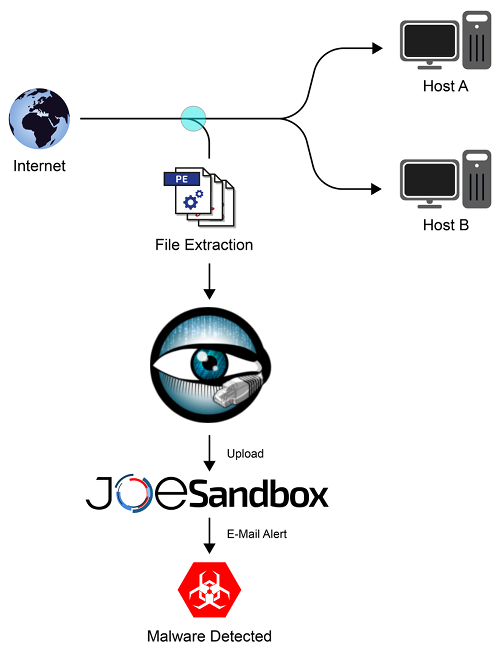
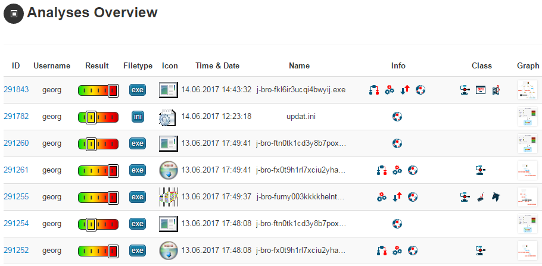
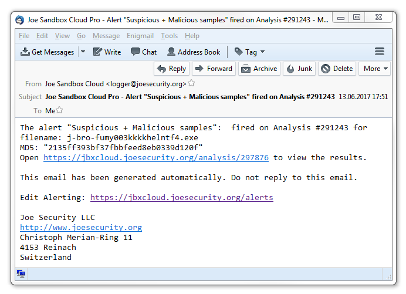
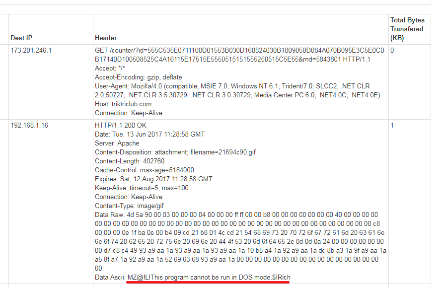

# JoeSandbox-Bro

JoeSandbox-[Bro](https://www.bro.org) is a simple bro script which extracts files from your internet connection and analyzes them automatically on [Joe Sandbox](https://www.joesecurity.org/).
By using this script you can fetch and detect malware payloads in HTTP, FTP and other protocols. Combined with Joe Sandbox's report and alerting features you can build with JoeSandbox-Bro a powerful IDS.

# Requirements

* Python 2.7 or 3.5+
* The `jbxapi` library: `pip install jbxapi`
* Bro 2.5
* The [Bro package manager](http://bro-package-manager.readthedocs.io): `pip install bro-pkg`

# Installation (for people familiar with Bro)

1. Installation

        pip install jbxapi
        bro-pkg refresh
        bro-pkg install joesecurity/Joe-Sandbox-Bro

2. Configuration

    The most important settings are your api key and accepting the terms and conditions:

        # api key
        redef JoeSandbox::apikey = "YOUR API KEY";

        # https://jbxcloud.joesecurity.org/download/termsandconditions.pdf
        redef JoeSandbox::accept_tac = T;

        # for on-premise installations
        # redef JoeSandbox::apiurl = "https://example.net/joesandbox/index.php/api/";

# Step-by-step for inexperienced users (not recommended for production environments)

1. Install Linux. (We used Ubuntu 16.04.)
2. Install Bro 2.5:

    [https://www.bro.org/download/packages.html](https://www.bro.org/download/packages.html)

3. You need to be root for the rest of this example:

        sudo -s

4. Install some software:

        pip install bro-pkg
        pip install jbxapi

5. Add Bro to your path:

        export PATH="$PATH:/opt/bro/bin"

6. Configure `bro-pkg` and download `Joe-Sandbox-Bro`:

        bro-pkg autoconfig
        bro-pkg install joesecurity/Joe-Sandbox-Bro

7. Write a small script and save it as `example.bro`:

        @load Joe-Sandbox-Bro

        redef JoeSandbox::apikey = "YOUR_API_KEY";
        # https://jbxcloud.joesecurity.org/download/termsandconditions.pdf
        redef JoeSandbox::accept_tac = T;

        # optionally submit sample.txt on startup
        # event bro_init()
        #     {
        #         when (local webids = JoeSandbox::submit("sample.txt")) {
        #             print webids;
        #         }
        #     }

8. Run Bro:

        bro -C -i eth0 example.bro

Bro now extracts all PE files it sees and uploads them to Joe Sandbox.

# Alerts for malicious files

If the script is working properly, you should now setup an alert to get notified if Joe Sandbox detect a file as malicious.
For this, open the alerts page in the web interface of Joe Sandbox and add a new alert. Set the `XPath` field to

    /analysis/signaturedetections/strategy[@name='empiric']/detection[text()='MAL']

Then add e-mail addresses and finally save the alert. You will now receive alerts for all malicious analysis.

# Example

During analysis in a network we were able to detect second stage downloads by [Kovter](www.joesecurity.org/reports/report-710857729c9adb7e41d9aac8ed842329.html):

# License

The code is licensed under MIT.

# Links

* [Bro](https://www.bro.org)
* [Joe Sandbox Cloud](https://www.joesecurity.org/joe-sandbox-cloud)

# Author

Joe Security ([@joe4security](https://twitter.com/joe4security) - [webpage](https://www.joesecurity.org))
